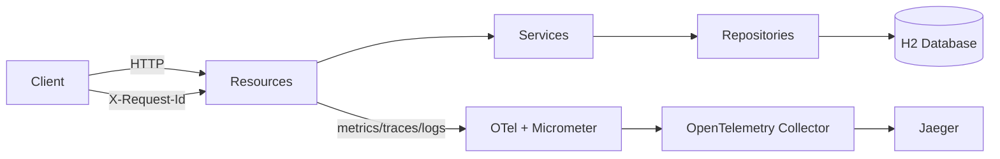

# Quarkus MS Demo

[](https://sonarcloud.io/project/overview?id=tiagolpadua_quarkus-ms-demo)
[](https://sonarcloud.io/project/overview?id=tiagolpadua_quarkus-ms-demo)
[](https://sonarcloud.io/project/overview?id=tiagolpadua_quarkus-ms-demo)
[](https://sonarcloud.io/project/overview?id=tiagolpadua_quarkus-ms-demo)
[](https://sonarcloud.io/project/overview?id=tiagolpadua_quarkus-ms-demo)
[](https://sonarcloud.io/project/overview?id=tiagolpadua_quarkus-ms-demo)
[](https://sonarcloud.io/project/overview?id=tiagolpadua_quarkus-ms-demo)
[](https://sonarcloud.io/project/overview?id=tiagolpadua_quarkus-ms-demo)

Tambien disponible en: [English](README.md) · [Portugues](README.pt-br.md)

## Tabla de Contenidos

- [Introduccion](#introduccion)
- [Resumen de Arquitectura](#resumen-de-arquitectura)
- [Estructura de Paquetes](#estructura-de-paquetes)
- [Formato de Respuesta de Listas](#formato-de-respuesta-de-listas)
- [Persistencia](#persistencia)
- [Dependencias y Plugins](#dependencias-y-plugins)
- [Ejecucion en Modo Desarrollo](#ejecucion-en-modo-desarrollo)
- [Ejecucion Local via Docker Compose](#ejecucion-local-via-docker-compose)
- [Pruebas y Cobertura](#pruebas-y-cobertura)
- [Observabilidad y Tracing](#observabilidad-y-tracing)
- [Comandos Utiles](#comandos-utiles)
- [Licencia](#licencia)

---

## Introduccion

Este proyecto es una API de ejemplo en Quarkus inspirada en el contrato Swagger Petstore.
Demuestra organizacion por dominio, diseno en capas, manejo de errores con RFC 7807,
observabilidad y verificaciones automatizadas de calidad en un unico servicio Java 21.

Este proyecto **NO** es un sistema de microservicios con multiples repositorios.
Es una **aplicacion Quarkus unica** con multiples dominios de negocio (`pet`, `store`, `user`).

Este proyecto tampoco es una plantilla lista para produccion.
Es una base educativa enfocada en claridad y mantenibilidad.

---

## Resumen de Arquitectura

La aplicacion esta organizada por dominio y por capas internas:

- **Capa Resource** — endpoints HTTP, manejo de request/response, anotaciones OpenAPI
- **Capa Service** — reglas de negocio, contadores de metricas
- **Capa Persistence** — entidades JPA, repositorios Panache, named queries
- **Capa Shared** — envelopes de respuesta, modelos de paginacion, filtro de log/correlacion, lifecycle hooks, health checks



### Componentes de la capa Shared

| Clase | Funcion |
| --- | --- |
| `LoggingFilter` | Filtro JAX-RS — registra cada request/response con `X-Request-Id`, `traceId`, `spanId`, duracion e IP remota |
| `ApplicationLifecycle` | Observa `StartupEvent` / `ShutdownEvent` y registra el perfil activo al iniciar |
| `RestEndpointLivenessHealthCheck` | Check `@Liveness` personalizado — hace ping a `/q/openapi` para verificar que la capa REST esta activa |
| `UiHomeResource` | Sirve la pagina HTML de inicio via Qute en `/` con enlaces a todas las herramientas de desarrollo |
| `ListResponse<T>` | Envelope para listas simples: `{ "items": [...] }` |
| `PagedResponse<T>` | Envelope paginado con metadatos de `page` y `sort` |
| `ApiResponse` | Envelope generico code/type/message usado por algunos endpoints |

---

## Estructura de Paquetes

```text
src/main/java/org/acme/
├── pet/
│   ├── persistence/     # Entidad JPA (Pet, Category, Tag) + PetRepository
│   ├── resources/       # JAX-RS PetResource
│   │   └── dtos/        # Records: PetRequest/Response, CategoryRequest/Response, TagRequest/Response
│   └── services/        # PetService (metricas @Counted)
│       └── mappers/     # PetMapper (MapStruct)
├── store/               # Mismo patron — entidad Order + StoreResource + StoreService
├── user/                # Mismo patron — entidad User + UserResource + UserService
│                        # Incluye ejemplos de @NamedQuery, @NamedNativeQuery y Criteria API
└── shared/
    ├── ApiResponse.java
    ├── ListResponse.java
    ├── LoggingFilter.java
    ├── ApplicationLifecycle.java
    ├── RestEndpointLivenessHealthCheck.java
    ├── UiHomeResource.java
    └── pagination/
        ├── PagedResponse.java
        ├── PageMetadata.java
        ├── SortMetadata.java
        └── PageResult.java
```

```text
src/test/java/org/acme/
├── pet/resources/       # PetResourceTest, PetResourceIT, PetResourceMockTest, PetServiceTest
├── store/resources/     # StoreResourceTest, StoreResourceIT, StoreResourceMockTest, StoreServiceTest
├── user/resources/      # UserResourceTest, UserResourceIT, UserResourceMockTest, UserServiceTest,
│                        # UserPanacheMockTest, ContractVerificationTests
└── rest/json/           # OpenApiResourceTest, OpenApiResourceIT,
                         # SwaggerUiPlaywrightTest, WireMockVirtualizationTest,
                         # TestProfileConfigOverrideTest
```

---

## Formato de Respuesta de Listas

El proyecto estandariza dos envelopes para respuestas de coleccion. Nunca se deben retornar arrays simples en el cuerpo de la respuesta.

**Lista simple** — use `ListResponse<T>`:

```json
{ "items": [ ... ] }
```

**Lista paginada** — use `PagedResponse<T>`:

```json
{
  "items": [ ... ],
  "page": {
    "number": 0,
    "size": 10,
    "totalElements": 42,
    "totalPages": 5,
    "first": true,
    "last": false,
    "hasNext": true,
    "hasPrevious": false
  },
  "sort": { "by": "username", "direction": "ASC" }
}
```

---

## Persistencia

- Base de datos H2 en memoria (`jdbc:h2:mem:default`), recreada en cada inicio (`drop-and-create`)
- Datos iniciales cargados desde [import.sql](src/main/resources/import.sql) (2 usuarios, 2 mascotas, 1 pedido)
- Las queries JPA deben usar `@NamedQuery`, `@NamedNativeQuery` o Criteria API — nunca `createQuery` con strings JPQL inline
- El dominio `user` contiene ejemplos explicitios de los tres enfoques, accesibles via `/user/examples/*`

---

## Dependencias y Plugins

### Extensiones Quarkus

| Extension | Funcion |
| --- | --- |
| [quarkus-rest](https://quarkus.io/guides/rest) + [quarkus-rest-jackson](https://quarkus.io/guides/rest-json) | Servidor REST reactivo con serializacion Jackson |
| [quarkus-rest-qute](https://quarkus.io/guides/qute-reference) | Motor de templates Qute — usado en la pagina HTML de inicio |
| [quarkus-smallrye-openapi](https://quarkus.io/guides/openapi-swaggerui) | Genera automaticamente el contrato OpenAPI y Swagger UI en `/q/swagger-ui` |
| [quarkus-hibernate-orm-panache](https://quarkus.io/guides/hibernate-orm-panache) | ORM con patrones Active Record y Repository simplificados |
| [quarkus-jdbc-h2](https://quarkus.io/guides/datasource) | Driver JDBC para la base de datos H2 en memoria |
| [quarkus-hibernate-validator](https://quarkus.io/guides/validation) | Bean Validation (`@NotBlank`, `@NotNull`, `@Valid`) en los DTOs de entrada |
| [quarkus-smallrye-health](https://quarkus.io/guides/smallrye-health) | Health checks en `/q/health`, `/q/health/live`, `/q/health/ready` |
| [quarkus-micrometer](https://quarkus.io/guides/micrometer) + [quarkus-micrometer-registry-prometheus](https://quarkus.io/guides/micrometer) | Metricas de la aplicacion expuestas en `/q/metrics` (formato Prometheus) |
| [quarkus-info](https://quarkus.io/guides/info) | Metadatos de build y git en `/q/info` |
| [quarkus-opentelemetry](https://quarkus.io/guides/opentelemetry) | Trazado distribuido via OTLP sin agente Java; correlaciona `traceId`/`spanId` en los logs |

### Bibliotecas

| Biblioteca | Funcion |
| --- | --- |
| [MapStruct 1.6](https://mapstruct.org/) | Generacion de mappers entre entidades y DTOs en tiempo de compilacion |
| [Lombok 1.18](https://projectlombok.org/) | Reduce boilerplate (`@RequiredArgsConstructor` para inyeccion por constructor) |
| [opentelemetry-jdbc](https://opentelemetry.io/docs/zero-code/java/agent/instrumentation/jdbc/) | Agrega spans OTel para instrucciones SQL individuales |
| [Bootstrap 5.3](https://getbootstrap.com/) | Framework CSS usado en la pagina Qute de inicio (servido via WebJar) |
| [quarkus-resteasy-problem](https://github.com/quarkiverse/quarkus-resteasy-problem) | Errores HTTP en formato RFC 7807 (`application/problem+json`) |

### Plugins Maven

| Plugin | Funcion |
| --- | --- |
| [Spotless + Google Java Format](https://github.com/diffplug/spotless) | Formato automatico de codigo; falla el build si no esta formateado |
| [JaCoCo](https://www.jacoco.org/jacoco/trunk/doc/maven.html) | Cobertura de codigo — genera reportes en `target/site/jacoco/`; exige minimo de 70 % de lineas cubiertas |
| [quarkus-maven-plugin](https://quarkus.io/guides/maven-tooling) | Ciclo de vida Quarkus: `quarkus:dev`, `package`, build nativo |

### Pruebas

| Herramienta | Funcion |
| --- | --- |
| [quarkus-junit](https://quarkus.io/guides/getting-started-testing) | `@QuarkusTest` (integracion en JVM) y `@QuarkusIntegrationTest` (contra el binario empaquetado) |
| [REST-assured](https://rest-assured.io/) | DSL fluente para pruebas de endpoints HTTP |
| [Mockito](https://site.mockito.org/) | Framework de mocks; `@Mock`, `@InjectMocks`, `@Spy` para pruebas unitarias y de servicio |
| [quarkus-junit-mockito](https://quarkus.io/guides/getting-started-testing#injecting-mocks) | `@InjectMock` — reemplaza un bean CDI con un mock Mockito dentro de `@QuarkusTest` |
| [quarkus-panache-mock](https://quarkus.io/guides/hibernate-orm-panache#mocking) | `PanacheMock` — hace mock de metodos estaticos Panache dentro de `@QuarkusTest` |
| [AssertJ](https://assertj.github.io/doc/) | Biblioteca de assertions fluente y legible |
| [WireMock](https://wiremock.org/) | Servidor HTTP stub para probar integraciones con servicios externos |
| [Playwright](https://playwright.dev/) | Pruebas E2E con navegador (ej.: Swagger UI) |

---

## Ejecucion en Modo Desarrollo

```bash
./run.sh
# o: ./mvnw quarkus:dev
```

Con dev mode activo:

| URL | Proposito |
| --- | --- |
| `http://localhost:8080` | Pagina de inicio (Qute) — enlaces a todas las herramientas de desarrollo |
| `http://localhost:8080/q/swagger-ui` | Swagger UI |
| `http://localhost:8080/q/dev-ui` | Dev UI — consola H2, config, extensiones |
| `http://localhost:8080/q/health` | Health agregado (incluye check de liveness personalizado) |
| `http://localhost:8080/q/metrics` | Metricas Prometheus |
| `http://localhost:8080/q/info` | Informacion de build y git |

> La consola H2 es accesible desde el panel de datasource del Dev UI. La ejecucion de SQL requiere `%dev.quarkus.datasource.dev-ui.allow-sql=true` (ya configurado).

---

## Ejecucion Local via Docker Compose

Primero genere el paquete de la aplicacion y luego levante el stack local.

```bash
./mvnw package -DskipTests
docker compose up
```

> [!NOTE]
> Durante el arranque algunos servicios pueden registrar errores transitorios de conexion hasta que las dependencias esten saludables.
> Esto es esperado en orquestacion local de contenedores.

| URL | Servicio |
| --- | --- |
| `http://localhost:8080` | Aplicacion |
| `http://localhost:8080/q/swagger-ui` | Swagger UI |
| `http://localhost:8080/q/health` | Health |
| `http://localhost:8080/q/metrics` | Metricas |
| `http://localhost:16686` | Jaeger UI |
| `http://localhost:13133` | Health del OTEL Collector |

> [!TIP]
> Si su entorno no soporta `docker compose`, pruebe `docker-compose`.

---

## Pruebas y Cobertura

Ejecute pruebas y validacion de formato:

```bash
./run-check.sh
```

Genere y abra el reporte de cobertura:

```bash
./mvnw test
open target/site/jacoco/index.html
```

Artefactos de cobertura:

- `target/jacoco.exec`
- `target/site/jacoco/jacoco.xml`
- `target/site/jacoco/index.html`

Patrones de prueba utilizados en este proyecto:

| Patron | Anotacion / Herramienta | Proposito |
| --- | --- | --- |
| Prueba de integracion | `@QuarkusTest` | Stack HTTP real + H2; usa REST-Assured |
| Prueba de integracion binaria | `@QuarkusIntegrationTest` | Ejecuta contra el JAR/binario nativo empaquetado |
| Prueba unitaria con mocks | `@ExtendWith(MockitoExtension.class)` | Java puro; `@Mock`, `@InjectMocks`, `@Spy` |
| Prueba parametrizada | `@ParameterizedTest` + `@ValueSource` / `@CsvSource` / `@NullAndEmptySource` | Multiples entradas en un unico metodo de prueba |
| Prueba con stub HTTP | `WireMockExtension` | Servidor HTTP real; sin contenedor Quarkus |
| Mock de bean CDI | `@InjectMock` (`quarkus-junit-mockito`) | Reemplaza un bean CDI dentro de `@QuarkusTest` |
| Mock estatico Panache | `PanacheMock` (`quarkus-panache-mock`) | Hace mock de metodos estaticos Active Record dentro de `@QuarkusTest` |
| E2E con navegador | Playwright | Controla el navegador contra la aplicacion en ejecucion |

---

## Observabilidad y Tracing

Cada solicitud recibe un header `X-Request-Id` (preservado del cliente o generado automaticamente). Los logs incluyen `requestId`, `traceId` y `spanId`. Las instrucciones SQL aparecen como spans hijo via `opentelemetry-jdbc`. Las metricas de negocio (`pet_create_total`, `user_create_total`) se exponen via Micrometer.

Para explorar trazas con el stack Docker Compose completo:

1. Levante el stack con `docker compose up`
2. Ejecute llamadas API (ej.: crear una mascota y luego buscarla por id)
3. Abra Jaeger en `http://localhost:16686`
4. Seleccione el servicio `quarkus-ms-demo` y busque trazas
5. Inspeccione spans para el flujo de la solicitud, queries SQL y tiempos

---

## Comandos Utiles

```bash
# Modo desarrollo
./run.sh

# Pruebas + validacion de formato
./run-check.sh

# Autoformato
./run-spotless-apply.sh

# Build completo (pruebas + pruebas de integracion + cobertura)
./run-build-prod.sh

# Build/ejecucion de imagen Docker
./run-docker.sh

# Targets Make
make help
make dev
make check
make fmt
make build
make docker
```

Scripts equivalentes para Windows disponibles como `*.cmd`.

---

## Licencia

Licencia MIT. Consulte [LICENSE](LICENSE).
