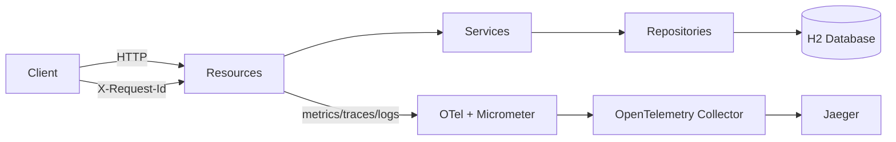

# Quarkus MS Demo

[](https://sonarcloud.io/project/overview?id=tiagolpadua_quarkus-ms-demo)
[](https://sonarcloud.io/project/overview?id=tiagolpadua_quarkus-ms-demo)
[](https://sonarcloud.io/project/overview?id=tiagolpadua_quarkus-ms-demo)
[](https://sonarcloud.io/project/overview?id=tiagolpadua_quarkus-ms-demo)
[](https://sonarcloud.io/project/overview?id=tiagolpadua_quarkus-ms-demo)
[](https://sonarcloud.io/project/overview?id=tiagolpadua_quarkus-ms-demo)
[](https://sonarcloud.io/project/overview?id=tiagolpadua_quarkus-ms-demo)
[](https://sonarcloud.io/project/overview?id=tiagolpadua_quarkus-ms-demo)

Tambien disponible en: [English](README.md) · [Portugues](README.pt-br.md)

## Tabla de Contenidos

- [Introduccion](#introduccion)
- [Resumen de Arquitectura](#resumen-de-arquitectura)
- [APIs y Capacidades](#apis-y-capacidades)
- [Ejecucion Local via Docker Compose](#ejecucion-local-via-docker-compose)
- [Ejecucion en Modo Desarrollo](#ejecucion-en-modo-desarrollo)
- [Pruebas y Cobertura](#pruebas-y-cobertura)
- [Estructura del Proyecto](#estructura-del-proyecto)
- [Observabilidad y Tracing](#observabilidad-y-tracing)
- [Comandos Utiles](#comandos-utiles)
- [Licencia](#licencia)

## Introduccion

Este proyecto es una API de ejemplo en Quarkus inspirada en el contrato Swagger Petstore.
Demuestra organizacion por dominio, diseno en capas, manejo de errores con RFC 7807,
observabilidad y verificaciones automatizadas de calidad en un unico servicio Java 21.

Este proyecto **NO** es un sistema de microservicios con multiples repositorios.
Es una **aplicacion Quarkus unica** con multiples dominios de negocio (`pet`, `store`, `user`).

Este proyecto tampoco **NO** es una plantilla lista para produccion.
Es una base educativa/profesional enfocada en claridad y mantenibilidad.

## Resumen de Arquitectura

La aplicacion esta organizada por dominio y por capas internas:

- Capa Resource: endpoints HTTP y manejo de request/response
- Capa Service: reglas de negocio
- Capa Persistence: entidades JPA y repositorios
- Capa Shared: envelopes de respuesta, modelos de paginacion y filtro de correlacion/log



## APIs y Capacidades

- Dominio `pet`
  - Gestion de mascotas, categorias, tags, busquedas por estado/tags y carga de imagen
- Dominio `store`
  - Inventario y gestion de ordenes
- Dominio `user`
  - Gestion de usuarios y ejemplos de query (`named-query`, `named-native-query`, `criteria`)

Capacidades transversales:

- Errores RFC 7807 via `application/problem+json`
- Bean Validation para payloads de entrada
- Correlacion de solicitudes con `X-Request-Id`
- Endpoint de metricas (`/q/metrics`)
- OpenAPI y Swagger UI (`/q/openapi`, `/q/swagger-ui`)
- Reportes de cobertura via JaCoCo (`target/site/jacoco`)

## Ejecucion Local via Docker Compose

Primero genere el paquete de la aplicacion y luego levante el stack local.

```bash
./mvnw package -DskipTests
docker compose up
```

> [!NOTE]
> Durante el arranque pueden aparecer errores transitorios de conexion hasta que las dependencias esten saludables.
> Esto es esperado en orquestacion local de contenedores.

Endpoints principales luego del arranque:

- App: http://localhost:8080
- Swagger UI: http://localhost:8080/q/swagger-ui
- Health: http://localhost:8080/q/health
- Metrics: http://localhost:8080/q/metrics
- Jaeger UI: http://localhost:16686
- Health de OTEL Collector: http://localhost:8888/healthz

> [!TIP]
> Si su entorno no soporta `docker compose`, pruebe `docker-compose`.

## Ejecucion en Modo Desarrollo

```bash
./run.sh
```

Alternativa:

```bash
./mvnw quarkus:dev
```

Con dev mode activo:

- App: http://localhost:8080
- Dev UI: http://localhost:8080/q/dev-ui
- Swagger UI: http://localhost:8080/q/swagger-ui

## Pruebas y Cobertura

Ejecute pruebas y validacion de formato:

```bash
./run-check.sh
```

Genere y abra el reporte de cobertura:

```bash
./mvnw test
open target/site/jacoco/index.html
```

Artefactos de cobertura generados por JaCoCo:

- `target/jacoco.exec`
- `target/site/jacoco/jacoco.xml`
- `target/site/jacoco/index.html`

## Estructura del Proyecto

```text
src/main/java/org/acme/
├── pet/
│   ├── persistence/
│   ├── resources/
│   │   └── dtos/
│   └── services/
│       └── mappers/
├── store/
│   ├── persistence/
│   ├── resources/
│   │   └── dtos/
│   └── services/
│       └── mappers/
├── user/
│   ├── persistence/
│   ├── resources/
│   │   └── dtos/
│   └── services/
│       └── mappers/
└── shared/
    ├── ApiResponse.java
    ├── ListResponse.java
    ├── LoggingFilter.java
    └── pagination/
```

Pruebas:

```text
src/test/java/org/acme/
├── pet/resources/
├── store/resources/
├── user/resources/
└── rest/json/
```

## Observabilidad y Tracing

La aplicacion emite logs con datos de correlacion y exporta trazas con OpenTelemetry.
Cuando corre con Docker Compose, las trazas pasan por el collector y llegan a Jaeger.

Flujo rapido:

1. Levante el stack con `docker compose up`
2. Ejecute llamadas API (por ejemplo, crear y consultar una mascota)
3. Abra Jaeger en http://localhost:16686
4. Seleccione el servicio `quarkus-ms-demo` y busque trazas
5. Inspeccione spans para flujo de solicitud y tiempos

## Comandos Utiles

```bash
# Modo desarrollo
./run.sh

# Pruebas + validacion de formato
./run-check.sh

# Autoformato
./run-spotless-apply.sh

# Build completo
./run-build-prod.sh

# Helper para imagen Docker/ejecucion
./run-docker.sh

# Targets Make
make help
make dev
make check
make fmt
make build
make docker
```

En Windows, use los scripts equivalentes (`*.cmd`).

## Licencia

Licencia MIT. Consulte [LICENSE](LICENSE).
