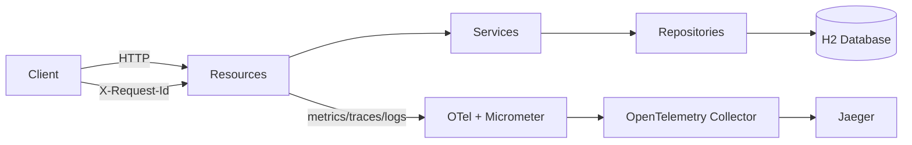

# Quarkus MS Demo

[](https://sonarcloud.io/project/overview?id=tiagolpadua_quarkus-ms-demo)
[](https://sonarcloud.io/project/overview?id=tiagolpadua_quarkus-ms-demo)
[](https://sonarcloud.io/project/overview?id=tiagolpadua_quarkus-ms-demo)
[](https://sonarcloud.io/project/overview?id=tiagolpadua_quarkus-ms-demo)
[](https://sonarcloud.io/project/overview?id=tiagolpadua_quarkus-ms-demo)
[](https://sonarcloud.io/project/overview?id=tiagolpadua_quarkus-ms-demo)
[](https://sonarcloud.io/project/overview?id=tiagolpadua_quarkus-ms-demo)
[](https://sonarcloud.io/project/overview?id=tiagolpadua_quarkus-ms-demo)

Also available in: [Português](README.pt-br.md) · [Español](README.es.md)

## Table of Contents

- [Introduction](#introduction)
- [Architecture Overview](#architecture-overview)
- [Package Structure](#package-structure)
- [List Response Format](#list-response-format)
- [Persistence](#persistence)
- [Dependencies and Plugins](#dependencies-and-plugins)
- [Running in Development Mode](#running-in-development-mode)
- [Running Locally via Docker Compose](#running-locally-via-docker-compose)
- [Testing and Coverage](#testing-and-coverage)
- [Observability and Tracing](#observability-and-tracing)
- [Useful Commands](#useful-commands)
- [License](#license)

---

## Introduction

This project is a Quarkus sample API inspired by the Swagger Petstore contract.
It demonstrates domain-oriented structure, layered design, RFC 7807 error handling,
observability, and automated quality checks in a single Java 21 service.

This is **NOT** a multi-repository microservices system.
This is a **single Quarkus application** with multiple business domains (`pet`, `store`, `user`).

This is also **NOT** a production-ready template.
It is an educational baseline focused on clarity and maintainability.

---

## Architecture Overview

The application is organized by domain and layered internally:

- **Resource layer** — HTTP endpoints, request/response handling, OpenAPI annotations
- **Service layer** — business rules, metrics counters
- **Persistence layer** — JPA entities, Panache repositories, named queries
- **Shared layer** — response envelopes, pagination models, logging/correlation filter, lifecycle hooks, health checks



### Shared layer components

| Class | Purpose |
| --- | --- |
| `LoggingFilter` | JAX-RS filter — logs every request/response with `X-Request-Id`, `traceId`, `spanId`, duration, and remote IP |
| `ApplicationLifecycle` | Observes `StartupEvent` / `ShutdownEvent` and logs active profile on boot |
| `RestEndpointLivenessHealthCheck` | Custom `@Liveness` check — pings `/q/openapi` to verify the REST layer is up |
| `UiHomeResource` | Serves a Qute HTML home page at `/` with links to all dev tools |
| `ListResponse<T>` | Envelope for simple list responses: `{ "items": [...] }` |
| `PagedResponse<T>` | Envelope for paginated responses with `page` and `sort` metadata |
| `ApiResponse` | Generic code/type/message envelope used by some endpoints |

---

## Package Structure

```text
src/main/java/org/acme/
├── pet/
│   ├── persistence/     # JPA entity (Pet, Category, Tag) + PetRepository
│   ├── resources/       # JAX-RS PetResource
│   │   └── dtos/        # Records: PetRequest/Response, CategoryRequest/Response, TagRequest/Response
│   └── services/        # PetService (@Counted metrics)
│       └── mappers/     # PetMapper (MapStruct)
├── store/               # Same pattern — Order entity + StoreResource + StoreService
├── user/                # Same pattern — User entity + UserResource + UserService
│                        # Includes @NamedQuery, @NamedNativeQuery, Criteria API examples
└── shared/
    ├── ApiResponse.java
    ├── ListResponse.java
    ├── LoggingFilter.java
    ├── ApplicationLifecycle.java
    ├── RestEndpointLivenessHealthCheck.java
    ├── UiHomeResource.java
    └── pagination/
        ├── PagedResponse.java
        ├── PageMetadata.java
        ├── SortMetadata.java
        └── PageResult.java
```

```text
src/test/java/org/acme/
├── pet/resources/       # PetResourceTest, PetResourceIT, PetResourceMockTest, PetServiceTest
├── store/resources/     # StoreResourceTest, StoreResourceIT, StoreResourceMockTest, StoreServiceTest
├── user/resources/      # UserResourceTest, UserResourceIT, UserResourceMockTest, UserServiceTest,
│                        # UserPanacheMockTest, ContractVerificationTests
└── rest/json/           # OpenApiResourceTest, OpenApiResourceIT,
                         # SwaggerUiPlaywrightTest, WireMockVirtualizationTest,
                         # TestProfileConfigOverrideTest
```

---

## List Response Format

The project standardizes two envelopes for collection responses. Never return bare arrays in the response body.

**Simple list** — use `ListResponse<T>`:

```json
{ "items": [ ... ] }
```

**Paginated list** — use `PagedResponse<T>`:

```json
{
  "items": [ ... ],
  "page": {
    "number": 0,
    "size": 10,
    "totalElements": 42,
    "totalPages": 5,
    "first": true,
    "last": false,
    "hasNext": true,
    "hasPrevious": false
  },
  "sort": { "by": "username", "direction": "ASC" }
}
```

---

## Persistence

- H2 in-memory database (`jdbc:h2:mem:default`), recreated on every boot (`drop-and-create`)
- Initial data loaded from [import.sql](src/main/resources/import.sql) (2 users, 2 pets, 1 order)
- JPA queries must use `@NamedQuery`, `@NamedNativeQuery`, or the Criteria API — never `createQuery` with inline JPQL strings
- The `user` domain contains explicit examples of all three approaches, accessible via `/user/examples/*`

---

## Dependencies and Plugins

### Quarkus Extensions

| Extension | Purpose |
| --- | --- |
| [quarkus-rest](https://quarkus.io/guides/rest) + [quarkus-rest-jackson](https://quarkus.io/guides/rest-json) | Reactive REST server with Jackson serialization |
| [quarkus-rest-qute](https://quarkus.io/guides/qute-reference) | Qute templating engine — used for the HTML home page |
| [quarkus-smallrye-openapi](https://quarkus.io/guides/openapi-swaggerui) | Auto-generates the OpenAPI contract and Swagger UI at `/q/swagger-ui` |
| [quarkus-hibernate-orm-panache](https://quarkus.io/guides/hibernate-orm-panache) | ORM with simplified Active Record and Repository patterns |
| [quarkus-jdbc-h2](https://quarkus.io/guides/datasource) | JDBC driver for the H2 in-memory database |
| [quarkus-hibernate-validator](https://quarkus.io/guides/validation) | Bean Validation (`@NotBlank`, `@NotNull`, `@Valid`) on request DTOs |
| [quarkus-smallrye-health](https://quarkus.io/guides/smallrye-health) | Health checks at `/q/health`, `/q/health/live`, `/q/health/ready` |
| [quarkus-micrometer](https://quarkus.io/guides/micrometer) + [quarkus-micrometer-registry-prometheus](https://quarkus.io/guides/micrometer) | Application metrics exposed at `/q/metrics` (Prometheus format) |
| [quarkus-info](https://quarkus.io/guides/info) | Build and git metadata at `/q/info` |
| [quarkus-opentelemetry](https://quarkus.io/guides/opentelemetry) | Distributed tracing via OTLP without a Java agent; correlates `traceId`/`spanId` in logs |

### Libraries

| Library | Purpose |
| --- | --- |
| [MapStruct 1.6](https://mapstruct.org/) | Compile-time mapper generation between entities and DTOs |
| [Lombok 1.18](https://projectlombok.org/) | Reduces boilerplate (`@RequiredArgsConstructor` for constructor injection) |
| [opentelemetry-jdbc](https://opentelemetry.io/docs/zero-code/java/agent/instrumentation/jdbc/) | Adds OTel spans for individual SQL statements |
| [Bootstrap 5.3](https://getbootstrap.com/) | CSS framework used in the Qute home page (served via WebJar) |
| [quarkus-resteasy-problem](https://github.com/quarkiverse/quarkus-resteasy-problem) | HTTP errors in RFC 7807 format (`application/problem+json`) |

### Maven Plugins

| Plugin | Purpose |
| --- | --- |
| [Spotless + Google Java Format](https://github.com/diffplug/spotless) | Automatic code formatting; fails the build if code is not formatted |
| [JaCoCo](https://www.jacoco.org/jacoco/trunk/doc/maven.html) | Code coverage — generates reports in `target/site/jacoco/` |
| [quarkus-maven-plugin](https://quarkus.io/guides/maven-tooling) | Quarkus lifecycle: `quarkus:dev`, `package`, native build |

### Testing

| Tool | Purpose |
| --- | --- |
| [quarkus-junit](https://quarkus.io/guides/getting-started-testing) | `@QuarkusTest` (integration on JVM) and `@QuarkusIntegrationTest` (against packaged binary) |
| [REST-assured](https://rest-assured.io/) | Fluent DSL for HTTP endpoint testing |
| [Mockito](https://site.mockito.org/) | Mocking framework for unit and service-layer tests |
| [AssertJ](https://assertj.github.io/doc/) | Fluent, readable assertion library |
| [WireMock](https://wiremock.org/) | HTTP stub server for testing external service interactions |
| [Playwright](https://playwright.dev/) | Browser-based end-to-end tests (e.g., Swagger UI) |

---

## Running in Development Mode

```bash
./run.sh
# or: ./mvnw quarkus:dev
```

With dev mode running:

| URL | Purpose |
| --- | --- |
| `http://localhost:8080` | Home page (Qute) — links to all dev tools |
| `http://localhost:8080/q/swagger-ui` | Swagger UI |
| `http://localhost:8080/q/dev-ui` | Dev UI — H2 console, config, extensions |
| `http://localhost:8080/q/health` | Aggregated health (includes custom liveness check) |
| `http://localhost:8080/q/metrics` | Prometheus metrics |
| `http://localhost:8080/q/info` | Build and git info |

> The H2 console is accessible via the Dev UI datasource panel. SQL execution requires `%dev.quarkus.datasource.dev-ui.allow-sql=true` (already configured).

---

## Running Locally via Docker Compose

Build the application package first, then start the local stack.

```bash
./mvnw package -DskipTests
docker compose up
```

> [!NOTE]
> During startup, some services may log transient connection errors until dependencies are healthy.
> This is expected in local container orchestration.

| URL | Service |
| --- | --- |
| `http://localhost:8080` | Application |
| `http://localhost:8080/q/swagger-ui` | Swagger UI |
| `http://localhost:8080/q/health` | Health |
| `http://localhost:8080/q/metrics` | Metrics |
| `http://localhost:16686` | Jaeger UI |
| `http://localhost:8888/healthz` | OTEL Collector health |

> [!TIP]
> If your environment does not support `docker compose`, try `docker-compose`.

---

## Testing and Coverage

Run tests and formatting validation:

```bash
./run-check.sh
```

Generate and open the coverage report:

```bash
./mvnw test
open target/site/jacoco/index.html
```

Coverage artifacts:

- `target/jacoco.exec`
- `target/site/jacoco/jacoco.xml`
- `target/site/jacoco/index.html`

Test class types:

| Annotation | Runs against | Purpose |
| --- | --- | --- |
| `@QuarkusTest` | Embedded Quarkus (JVM) | Fast tests; real HTTP stack, real DB |
| `@QuarkusIntegrationTest` | Packaged JAR/binary | Validates the final artifact end-to-end |

---

## Observability and Tracing

Every request receives an `X-Request-Id` header (preserved from the client or auto-generated). Logs include `requestId`, `traceId`, and `spanId`. SQL statements appear as child spans via `opentelemetry-jdbc`. Business metrics (`pet_create_total`, `user_create_total`) are exposed via Micrometer.

To explore traces with the full Docker Compose stack:

1. Start the stack with `docker compose up`
2. Execute API calls (e.g., create a pet, then fetch by id)
3. Open Jaeger at `http://localhost:16686`
4. Select service `quarkus-ms-demo` and search traces
5. Inspect spans for request flow, SQL queries, and timings

---

## Useful Commands

```bash
# Dev mode
./run.sh

# Tests + formatting check
./run-check.sh

# Auto-format
./run-spotless-apply.sh

# Full build (tests + integration tests + coverage)
./run-build-prod.sh

# Docker image build/run
./run-docker.sh

# Make targets
make help
make dev
make check
make fmt
make build
make docker
```

Windows equivalents are available as `*.cmd` scripts.

---

## License

MIT License. See [LICENSE](LICENSE).
