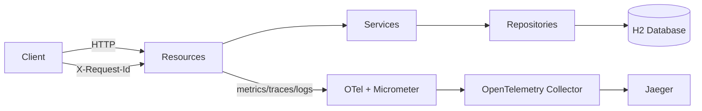

# Quarkus MS Demo

[](https://sonarcloud.io/project/overview?id=tiagolpadua_quarkus-ms-demo)
[](https://sonarcloud.io/project/overview?id=tiagolpadua_quarkus-ms-demo)
[](https://sonarcloud.io/project/overview?id=tiagolpadua_quarkus-ms-demo)
[](https://sonarcloud.io/project/overview?id=tiagolpadua_quarkus-ms-demo)
[](https://sonarcloud.io/project/overview?id=tiagolpadua_quarkus-ms-demo)
[](https://sonarcloud.io/project/overview?id=tiagolpadua_quarkus-ms-demo)
[](https://sonarcloud.io/project/overview?id=tiagolpadua_quarkus-ms-demo)
[](https://sonarcloud.io/project/overview?id=tiagolpadua_quarkus-ms-demo)

Also available in: [Portugues](README.pt-br.md) · [Espanol](README.es.md)

## Table of Contents

- [Introduction](#introduction)
- [Architecture Overview](#architecture-overview)
- [APIs and Capabilities](#apis-and-capabilities)
- [Running Locally via Docker Compose](#running-locally-via-docker-compose)
- [Running in Development Mode](#running-in-development-mode)
- [Testing and Coverage](#testing-and-coverage)
- [Project Structure](#project-structure)
- [Observability and Tracing](#observability-and-tracing)
- [Useful Commands](#useful-commands)
- [License](#license)

## Introduction

This project is a Quarkus sample API inspired by the Swagger Petstore contract.
It demonstrates a domain-oriented structure, layered design, RFC 7807 error handling,
observability, and automated quality checks in a single Java 21 service.

This is **NOT** a multi-repository microservices system.
This is a **single Quarkus application** with multiple business domains (`pet`, `store`, `user`).

This is also **NOT** a production-ready template.
It is an educational/professional baseline focused on clarity and maintainability.

## Architecture Overview

The application is organized by domain and layered internally:

- Resource layer: HTTP endpoints and request/response handling
- Service layer: business rules
- Persistence layer: JPA entities and repositories
- Shared layer: response envelopes, pagination models, and logging/correlation filter



## APIs and Capabilities

- `pet` domain
  - Manage pets, categories, tags, status/tag searches, image upload
- `store` domain
  - Manage store inventory and orders
- `user` domain
  - Manage users and include query examples (`named-query`, `named-native-query`, `criteria`)

Cross-cutting capabilities:

- RFC 7807 error responses via `application/problem+json`
- Bean Validation for input payloads
- Request correlation with `X-Request-Id`
- Metrics endpoint (`/q/metrics`)
- OpenAPI and Swagger UI (`/q/openapi`, `/q/swagger-ui`)
- Coverage reports via JaCoCo (`target/site/jacoco`)

## Running Locally via Docker Compose

Build the application package first, then start the local stack.

```bash
./mvnw package -DskipTests
docker compose up
```

> [!NOTE]
> During startup, some services may log transient connection errors until dependencies are healthy.
> This is expected in local container orchestration.

Main endpoints after startup:

- App: http://localhost:8080
- Swagger UI: http://localhost:8080/q/swagger-ui
- Health: http://localhost:8080/q/health
- Metrics: http://localhost:8080/q/metrics
- Jaeger UI: http://localhost:16686
- OTEL Collector health: http://localhost:8888/healthz

> [!TIP]
> If your environment does not support `docker compose`, try `docker-compose`.

## Running in Development Mode

```bash
./run.sh
```

Alternative:

```bash
./mvnw quarkus:dev
```

With dev mode running:

- App: http://localhost:8080
- Dev UI: http://localhost:8080/q/dev-ui
- Swagger UI: http://localhost:8080/q/swagger-ui

## Testing and Coverage

Run tests and formatting checks:

```bash
./run-check.sh
```

Generate and inspect coverage report:

```bash
./mvnw test
open target/site/jacoco/index.html
```

Coverage artifacts generated by JaCoCo:

- `target/jacoco.exec`
- `target/site/jacoco/jacoco.xml`
- `target/site/jacoco/index.html`

## Project Structure

```text
src/main/java/org/acme/
├── pet/
│   ├── persistence/
│   ├── resources/
│   │   └── dtos/
│   └── services/
│       └── mappers/
├── store/
│   ├── persistence/
│   ├── resources/
│   │   └── dtos/
│   └── services/
│       └── mappers/
├── user/
│   ├── persistence/
│   ├── resources/
│   │   └── dtos/
│   └── services/
│       └── mappers/
└── shared/
    ├── ApiResponse.java
    ├── ListResponse.java
    ├── LoggingFilter.java
    └── pagination/
```

Tests:

```text
src/test/java/org/acme/
├── pet/resources/
├── store/resources/
├── user/resources/
└── rest/json/
```

## Observability and Tracing

The app emits logs with correlation data and exports traces with OpenTelemetry.
When running with Docker Compose, traces go through the collector to Jaeger.

Quick walkthrough:

1. Start the stack with `docker compose up`
2. Execute API calls (for example, create a pet and fetch by id)
3. Open Jaeger at http://localhost:16686
4. Select service `quarkus-ms-demo` and search traces
5. Inspect spans for request flow and timings

## Useful Commands

```bash
# Dev mode
./run.sh

# Tests + formatting check
./run-check.sh

# Auto-format
./run-spotless-apply.sh

# Full build
./run-build-prod.sh

# Docker image build/run helper
./run-docker.sh

# Make targets
make help
make dev
make check
make fmt
make build
make docker
```

Windows equivalents are also available (`*.cmd` scripts).

## License

MIT License. See [LICENSE](LICENSE).
