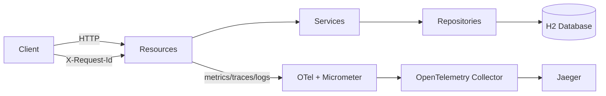

# Quarkus MS Demo

[](https://sonarcloud.io/project/overview?id=tiagolpadua_quarkus-ms-demo)
[](https://sonarcloud.io/project/overview?id=tiagolpadua_quarkus-ms-demo)
[](https://sonarcloud.io/project/overview?id=tiagolpadua_quarkus-ms-demo)
[](https://sonarcloud.io/project/overview?id=tiagolpadua_quarkus-ms-demo)
[](https://sonarcloud.io/project/overview?id=tiagolpadua_quarkus-ms-demo)
[](https://sonarcloud.io/project/overview?id=tiagolpadua_quarkus-ms-demo)
[](https://sonarcloud.io/project/overview?id=tiagolpadua_quarkus-ms-demo)
[](https://sonarcloud.io/project/overview?id=tiagolpadua_quarkus-ms-demo)

Tambem disponivel em: [English](README.md) · [Espanol](README.es.md)

## Sumario

- [Introducao](#introducao)
- [Visao Geral da Arquitetura](#visao-geral-da-arquitetura)
- [APIs e Capacidades](#apis-e-capacidades)
- [Execucao Local via Docker Compose](#execucao-local-via-docker-compose)
- [Execucao em Modo Desenvolvimento](#execucao-em-modo-desenvolvimento)
- [Testes e Cobertura](#testes-e-cobertura)
- [Estrutura do Projeto](#estrutura-do-projeto)
- [Observabilidade e Tracing](#observabilidade-e-tracing)
- [Comandos Uteis](#comandos-uteis)
- [Licenca](#licenca)

## Introducao

Este projeto e uma API de exemplo em Quarkus inspirada no contrato Swagger Petstore.
Ele demonstra organizacao por dominio, design em camadas, tratamento de erros com RFC 7807,
observabilidade e verificacoes automatizadas de qualidade em um unico servico Java 21.

Este projeto **NAO** e um sistema de microservicos com multiplos repositorios.
Ele e uma **aplicacao Quarkus unica** com multiplos dominios de negocio (`pet`, `store`, `user`).

Este projeto tambem **NAO** e um template pronto para producao.
Ele e uma base educacional/profissional focada em clareza e manutenibilidade.

## Visao Geral da Arquitetura

A aplicacao e organizada por dominio e internamente em camadas:

- Camada Resource: endpoints HTTP e tratamento de request/response
- Camada Service: regras de negocio
- Camada Persistence: entidades JPA e repositorios
- Camada Shared: envelopes de resposta, modelos de paginacao e filtro de correlacao/log



## APIs e Capacidades

- Dominio `pet`
  - Cadastro de pets, categorias, tags, buscas por status/tags, upload de imagem
- Dominio `store`
  - Inventario e gestao de pedidos
- Dominio `user`
  - Gestao de usuarios e exemplos de query (`named-query`, `named-native-query`, `criteria`)

Capacidades cross-cutting:

- Erros RFC 7807 via `application/problem+json`
- Bean Validation para payloads de entrada
- Correlacao de requisicoes com `X-Request-Id`
- Endpoint de metricas (`/q/metrics`)
- OpenAPI e Swagger UI (`/q/openapi`, `/q/swagger-ui`)
- Relatorios de cobertura via JaCoCo (`target/site/jacoco`)

## Execucao Local via Docker Compose

Gere o pacote da aplicacao e depois suba a stack local.

```bash
./mvnw package -DskipTests
docker compose up
```

> [!NOTE]
> Durante a inicializacao, podem aparecer erros transitorios de conexao ate as dependencias ficarem saudaveis.
> Isso e esperado em orquestracao local de containers.

Endpoints principais apos subir:

- App: http://localhost:8080
- Swagger UI: http://localhost:8080/q/swagger-ui
- Health: http://localhost:8080/q/health
- Metrics: http://localhost:8080/q/metrics
- Jaeger UI: http://localhost:16686
- Health do OTEL Collector: http://localhost:8888/healthz

> [!TIP]
> Se o seu ambiente nao suportar `docker compose`, tente `docker-compose`.

## Execucao em Modo Desenvolvimento

```bash
./run.sh
```

Alternativa:

```bash
./mvnw quarkus:dev
```

Com o dev mode ativo:

- App: http://localhost:8080
- Dev UI: http://localhost:8080/q/dev-ui
- Swagger UI: http://localhost:8080/q/swagger-ui

## Testes e Cobertura

Rode testes e validacao de formatacao:

```bash
./run-check.sh
```

Gere e abra o relatorio de cobertura:

```bash
./mvnw test
open target/site/jacoco/index.html
```

Artefatos de cobertura gerados pelo JaCoCo:

- `target/jacoco.exec`
- `target/site/jacoco/jacoco.xml`
- `target/site/jacoco/index.html`

## Estrutura do Projeto

```text
src/main/java/org/acme/
├── pet/
│   ├── persistence/
│   ├── resources/
│   │   └── dtos/
│   └── services/
│       └── mappers/
├── store/
│   ├── persistence/
│   ├── resources/
│   │   └── dtos/
│   └── services/
│       └── mappers/
├── user/
│   ├── persistence/
│   ├── resources/
│   │   └── dtos/
│   └── services/
│       └── mappers/
└── shared/
    ├── ApiResponse.java
    ├── ListResponse.java
    ├── LoggingFilter.java
    └── pagination/
```

Testes:

```text
src/test/java/org/acme/
├── pet/resources/
├── store/resources/
├── user/resources/
└── rest/json/
```

## Observabilidade e Tracing

A aplicacao emite logs com dados de correlacao e exporta traces com OpenTelemetry.
No Docker Compose, os traces passam pelo collector e chegam ao Jaeger.

Fluxo rapido:

1. Suba a stack com `docker compose up`
2. Execute chamadas de API (por exemplo, criar e buscar um pet)
3. Abra o Jaeger em http://localhost:16686
4. Selecione o servico `quarkus-ms-demo` e busque traces
5. Inspecione spans para fluxo da requisicao e tempos

## Comandos Uteis

```bash
# Dev mode
./run.sh

# Testes + validacao de formatacao
./run-check.sh

# Autoformatacao
./run-spotless-apply.sh

# Build completo
./run-build-prod.sh

# Helper para imagem Docker/execucao
./run-docker.sh

# Alvos Make
make help
make dev
make check
make fmt
make build
make docker
```

No Windows, use os scripts equivalentes (`*.cmd`).

## Licenca

Licenca MIT. Consulte [LICENSE](LICENSE).
