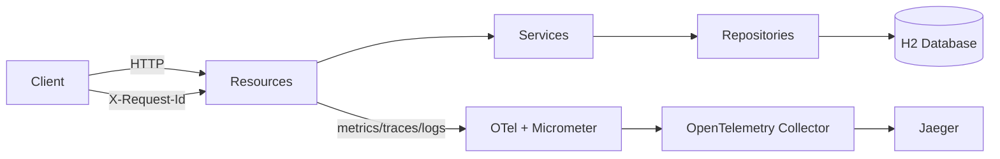

# Quarkus MS Demo

[](https://sonarcloud.io/project/overview?id=tiagolpadua_quarkus-ms-demo)
[](https://sonarcloud.io/project/overview?id=tiagolpadua_quarkus-ms-demo)
[](https://sonarcloud.io/project/overview?id=tiagolpadua_quarkus-ms-demo)
[](https://sonarcloud.io/project/overview?id=tiagolpadua_quarkus-ms-demo)
[](https://sonarcloud.io/project/overview?id=tiagolpadua_quarkus-ms-demo)
[](https://sonarcloud.io/project/overview?id=tiagolpadua_quarkus-ms-demo)
[](https://sonarcloud.io/project/overview?id=tiagolpadua_quarkus-ms-demo)
[](https://sonarcloud.io/project/overview?id=tiagolpadua_quarkus-ms-demo)

Tambem disponivel em: [English](README.md) · [Espanol](README.es.md)

## Sumario

- [Introducao](#introducao)
- [Visao Geral da Arquitetura](#visao-geral-da-arquitetura)
- [Estrutura de Pacotes](#estrutura-de-pacotes)
- [Formato de Resposta de Listas](#formato-de-resposta-de-listas)
- [Persistencia](#persistencia)
- [Dependencias e Plugins](#dependencias-e-plugins)
- [Execucao em Modo Desenvolvimento](#execucao-em-modo-desenvolvimento)
- [Execucao Local via Docker Compose](#execucao-local-via-docker-compose)
- [Testes e Cobertura](#testes-e-cobertura)
- [Observabilidade e Tracing](#observabilidade-e-tracing)
- [Comandos Uteis](#comandos-uteis)
- [Licenca](#licenca)

---

## Introducao

Este projeto e uma API de exemplo em Quarkus inspirada no contrato Swagger Petstore.
Ele demonstra organizacao por dominio, design em camadas, tratamento de erros com RFC 7807,
observabilidade e verificacoes automatizadas de qualidade em um unico servico Java 21.

Este projeto **NAO** e um sistema de microservicos com multiplos repositorios.
Ele e uma **aplicacao Quarkus unica** com multiplos dominios de negocio (`pet`, `store`, `user`).

Este projeto tambem **NAO** e um template pronto para producao.
E uma base educacional focada em clareza e manutenibilidade.

---

## Visao Geral da Arquitetura

A aplicacao e organizada por dominio e internamente em camadas:

- **Camada Resource** — endpoints HTTP, tratamento de request/response, anotacoes OpenAPI
- **Camada Service** — regras de negocio, contadores de metricas
- **Camada Persistence** — entidades JPA, repositorios Panache, named queries
- **Camada Shared** — envelopes de resposta, modelos de paginacao, filtro de log/correlacao, lifecycle hooks, health checks



### Componentes da camada Shared

| Classe | Funcao |
| --- | --- |
| `LoggingFilter` | Filtro JAX-RS — loga cada request/response com `X-Request-Id`, `traceId`, `spanId`, duracao e IP remoto |
| `ApplicationLifecycle` | Observa `StartupEvent` / `ShutdownEvent` e loga o perfil ativo na inicializacao |
| `RestEndpointLivenessHealthCheck` | Check `@Liveness` customizado — faz ping em `/q/openapi` para verificar se a camada REST esta no ar |
| `UiHomeResource` | Serve a pagina HTML inicial via Qute em `/` com links para todas as ferramentas de desenvolvimento |
| `ListResponse<T>` | Envelope para listas simples: `{ "items": [...] }` |
| `PagedResponse<T>` | Envelope paginado com metadados de `page` e `sort` |
| `ApiResponse` | Envelope generico code/type/message usado por alguns endpoints |

---

## Estrutura de Pacotes

```text
src/main/java/org/acme/
├── pet/
│   ├── persistence/     # Entidade JPA (Pet, Category, Tag) + PetRepository
│   ├── resources/       # JAX-RS PetResource
│   │   └── dtos/        # Records: PetRequest/Response, CategoryRequest/Response, TagRequest/Response
│   └── services/        # PetService (metricas @Counted)
│       └── mappers/     # PetMapper (MapStruct)
├── store/               # Mesmo padrao — entidade Order + StoreResource + StoreService
├── user/                # Mesmo padrao — entidade User + UserResource + UserService
│                        # Inclui exemplos de @NamedQuery, @NamedNativeQuery e Criteria API
└── shared/
    ├── ApiResponse.java
    ├── ListResponse.java
    ├── LoggingFilter.java
    ├── ApplicationLifecycle.java
    ├── RestEndpointLivenessHealthCheck.java
    ├── UiHomeResource.java
    └── pagination/
        ├── PagedResponse.java
        ├── PageMetadata.java
        ├── SortMetadata.java
        └── PageResult.java
```

```text
src/test/java/org/acme/
├── pet/resources/       # PetResourceTest, PetResourceIT, PetResourceMockTest, PetServiceTest
├── store/resources/     # StoreResourceTest, StoreResourceIT, StoreResourceMockTest, StoreServiceTest
├── user/resources/      # UserResourceTest, UserResourceIT, UserResourceMockTest, UserServiceTest,
│                        # UserPanacheMockTest, ContractVerificationTests
└── rest/json/           # OpenApiResourceTest, OpenApiResourceIT,
                         # SwaggerUiPlaywrightTest, WireMockVirtualizationTest,
                         # TestProfileConfigOverrideTest
```

---

## Formato de Resposta de Listas

O projeto padroniza dois envelopes para respostas de colecao. Nunca retorne arrays brutos no corpo da resposta.

**Lista simples** — use `ListResponse<T>`:

```json
{ "items": [ ... ] }
```

**Lista paginada** — use `PagedResponse<T>`:

```json
{
  "items": [ ... ],
  "page": {
    "number": 0,
    "size": 10,
    "totalElements": 42,
    "totalPages": 5,
    "first": true,
    "last": false,
    "hasNext": true,
    "hasPrevious": false
  },
  "sort": { "by": "username", "direction": "ASC" }
}
```

---

## Persistencia

- Banco H2 em memoria (`jdbc:h2:mem:default`), recriado a cada inicializacao (`drop-and-create`)
- Dados iniciais carregados de [import.sql](src/main/resources/import.sql) (2 usuarios, 2 pets, 1 pedido)
- Queries JPA devem usar `@NamedQuery`, `@NamedNativeQuery` ou Criteria API — nunca `createQuery` com strings JPQL inline
- O dominio `user` contem exemplos explicitos das tres abordagens, acessiveis via `/user/examples/*`

---

## Dependencias e Plugins

### Extensoes Quarkus

| Extensao | Funcao |
| --- | --- |
| [quarkus-rest](https://quarkus.io/guides/rest) + [quarkus-rest-jackson](https://quarkus.io/guides/rest-json) | Servidor REST reativo com serializacao Jackson |
| [quarkus-rest-qute](https://quarkus.io/guides/qute-reference) | Engine de templates Qute — usada na pagina HTML inicial |
| [quarkus-smallrye-openapi](https://quarkus.io/guides/openapi-swaggerui) | Gera automaticamente o contrato OpenAPI e o Swagger UI em `/q/swagger-ui` |
| [quarkus-hibernate-orm-panache](https://quarkus.io/guides/hibernate-orm-panache) | ORM com padroes Active Record e Repository simplificados |
| [quarkus-jdbc-h2](https://quarkus.io/guides/datasource) | Driver JDBC para o banco H2 em memoria |
| [quarkus-hibernate-validator](https://quarkus.io/guides/validation) | Bean Validation (`@NotBlank`, `@NotNull`, `@Valid`) nos DTOs de entrada |
| [quarkus-smallrye-health](https://quarkus.io/guides/smallrye-health) | Health checks em `/q/health`, `/q/health/live`, `/q/health/ready` |
| [quarkus-micrometer](https://quarkus.io/guides/micrometer) + [quarkus-micrometer-registry-prometheus](https://quarkus.io/guides/micrometer) | Metricas da aplicacao expostas em `/q/metrics` (formato Prometheus) |
| [quarkus-info](https://quarkus.io/guides/info) | Metadados de build e git em `/q/info` |
| [quarkus-opentelemetry](https://quarkus.io/guides/opentelemetry) | Tracing distribuido via OTLP sem agente Java; correlaciona `traceId`/`spanId` nos logs |

### Bibliotecas

| Biblioteca | Funcao |
| --- | --- |
| [MapStruct 1.6](https://mapstruct.org/) | Geracao de mappers entre entidades e DTOs em tempo de compilacao |
| [Lombok 1.18](https://projectlombok.org/) | Reduz boilerplate (`@RequiredArgsConstructor` para injecao por construtor) |
| [opentelemetry-jdbc](https://opentelemetry.io/docs/zero-code/java/agent/instrumentation/jdbc/) | Adiciona spans OTel para instrucoes SQL individuais |
| [Bootstrap 5.3](https://getbootstrap.com/) | Framework CSS usado na pagina Qute inicial (servido via WebJar) |
| [quarkus-resteasy-problem](https://github.com/quarkiverse/quarkus-resteasy-problem) | Erros HTTP no formato RFC 7807 (`application/problem+json`) |

### Plugins Maven

| Plugin | Funcao |
| --- | --- |
| [Spotless + Google Java Format](https://github.com/diffplug/spotless) | Formatacao automatica de codigo; falha o build se nao estiver formatado |
| [JaCoCo](https://www.jacoco.org/jacoco/trunk/doc/maven.html) | Cobertura de codigo — gera relatorios em `target/site/jacoco/`; exige minimo de 70 % de linhas cobertas |
| [quarkus-maven-plugin](https://quarkus.io/guides/maven-tooling) | Ciclo de vida Quarkus: `quarkus:dev`, `package`, build nativo |

### Testes

| Ferramenta | Funcao |
| --- | --- |
| [quarkus-junit](https://quarkus.io/guides/getting-started-testing) | `@QuarkusTest` (integracao na JVM) e `@QuarkusIntegrationTest` (contra o binario empacotado) |
| [REST-assured](https://rest-assured.io/) | DSL fluente para testes de endpoints HTTP |
| [Mockito](https://site.mockito.org/) | Framework de mocks; `@Mock`, `@InjectMocks`, `@Spy` para testes unitarios e de servico |
| [quarkus-junit-mockito](https://quarkus.io/guides/getting-started-testing#injecting-mocks) | `@InjectMock` — substitui um bean CDI por um mock Mockito dentro de `@QuarkusTest` |
| [quarkus-panache-mock](https://quarkus.io/guides/hibernate-orm-panache#mocking) | `PanacheMock` — faz mock de metodos estaticos Panache dentro de `@QuarkusTest` |
| [AssertJ](https://assertj.github.io/doc/) | Biblioteca de assertions fluente e legivel |
| [WireMock](https://wiremock.org/) | Servidor HTTP stub para testar integracoes com servicos externos |
| [Playwright](https://playwright.dev/) | Testes E2E com browser (ex.: Swagger UI) |

---

## Execucao em Modo Desenvolvimento

```bash
./run.sh
# ou: ./mvnw quarkus:dev
```

Com o dev mode ativo:

| URL | Finalidade |
| --- | --- |
| `http://localhost:8080` | Pagina inicial (Qute) — links para todas as ferramentas de desenvolvimento |
| `http://localhost:8080/q/swagger-ui` | Swagger UI |
| `http://localhost:8080/q/dev-ui` | Dev UI — console H2, config, extensoes |
| `http://localhost:8080/q/health` | Health agregado (inclui check de liveness customizado) |
| `http://localhost:8080/q/metrics` | Metricas Prometheus |
| `http://localhost:8080/q/info` | Informacoes de build e git |

> O console H2 esta acessivel pelo painel de datasource do Dev UI. A execucao de SQL requer `%dev.quarkus.datasource.dev-ui.allow-sql=true` (ja configurado).

---

## Execucao Local via Docker Compose

Gere o pacote da aplicacao primeiro e depois suba a stack local.

```bash
./mvnw package -DskipTests
docker compose up
```

> [!NOTE]
> Durante a inicializacao, alguns servicos podem registrar erros transitorios de conexao ate que as dependencias estejam saudaveis.
> Isso e esperado em orquestracao local de containers.

| URL | Servico |
| --- | --- |
| `http://localhost:8080` | Aplicacao |
| `http://localhost:8080/q/swagger-ui` | Swagger UI |
| `http://localhost:8080/q/health` | Health |
| `http://localhost:8080/q/metrics` | Metricas |
| `http://localhost:16686` | Jaeger UI |
| `http://localhost:8888/healthz` | Health do OTEL Collector |

> [!TIP]
> Se o seu ambiente nao suportar `docker compose`, tente `docker-compose`.

---

## Testes e Cobertura

Rode testes e validacao de formatacao:

```bash
./run-check.sh
```

Gere e abra o relatorio de cobertura:

```bash
./mvnw test
open target/site/jacoco/index.html
```

Artefatos de cobertura:

- `target/jacoco.exec`
- `target/site/jacoco/jacoco.xml`
- `target/site/jacoco/index.html`

Padroes de teste utilizados neste projeto:

| Padrao | Anotacao / Ferramenta | Finalidade |
| --- | --- | --- |
| Teste de integracao | `@QuarkusTest` | Stack HTTP real + H2; usa REST-Assured |
| Teste de integracao binario | `@QuarkusIntegrationTest` | Executa contra o JAR/binario nativo empacotado |
| Teste unitario com mocks | `@ExtendWith(MockitoExtension.class)` | Java puro; `@Mock`, `@InjectMocks`, `@Spy` |
| Teste parametrizado | `@ParameterizedTest` + `@ValueSource` / `@CsvSource` / `@NullAndEmptySource` | Multiplas entradas em um unico metodo de teste |
| Teste com stub HTTP | `WireMockExtension` | Servidor HTTP real; sem container Quarkus |
| Mock de bean CDI | `@InjectMock` (`quarkus-junit-mockito`) | Substitui um bean CDI dentro de `@QuarkusTest` |
| Mock estatico Panache | `PanacheMock` (`quarkus-panache-mock`) | Faz mock de metodos estaticos Active Record dentro de `@QuarkusTest` |
| E2E com browser | Playwright | Controla o browser contra a aplicacao em execucao |

---

## Observabilidade e Tracing

Cada requisicao recebe um header `X-Request-Id` (preservado do cliente ou gerado automaticamente). Os logs incluem `requestId`, `traceId` e `spanId`. Instrucoes SQL aparecem como spans filhos via `opentelemetry-jdbc`. Metricas de negocio (`pet_create_total`, `user_create_total`) sao expostas via Micrometer.

Para explorar traces com a stack Docker Compose completa:

1. Suba a stack com `docker compose up`
2. Execute chamadas de API (ex.: criar um pet e depois busca-lo por id)
3. Abra o Jaeger em `http://localhost:16686`
4. Selecione o servico `quarkus-ms-demo` e busque traces
5. Inspecione spans para o fluxo da requisicao, queries SQL e tempos

---

## Comandos Uteis

```bash
# Dev mode
./run.sh

# Testes + validacao de formatacao
./run-check.sh

# Autoformatacao
./run-spotless-apply.sh

# Build completo (testes + testes de integracao + cobertura)
./run-build-prod.sh

# Build/execucao da imagem Docker
./run-docker.sh

# Alvos Make
make help
make dev
make check
make fmt
make build
make docker
```

Scripts equivalentes para Windows disponiveis como `*.cmd`.

---

## Licenca

Licenca MIT. Consulte [LICENSE](LICENSE).
